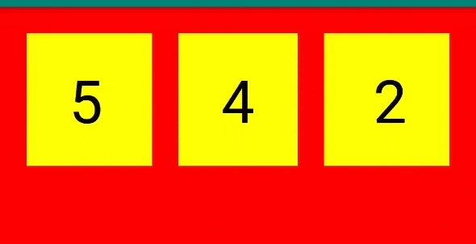
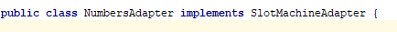
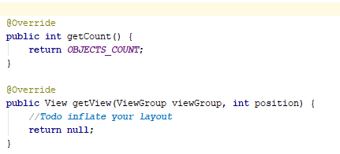
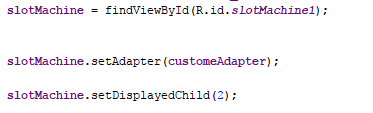
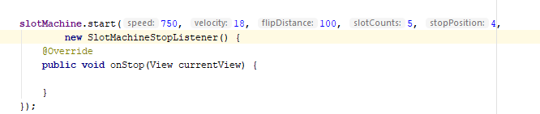
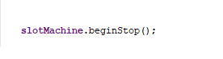

[](https://jitpack.io/#ahmedezz012/SlotMachine)

# SlotMachine


SlotMachine is a android library for creating slotmachine view



## Installation

in root build.gradle
```bash
  allprojects {
		repositories {
			...
			maven { url "https://jitpack.io" }
		}
	}```
	
in app build.gradle
```bash
	dependencies {
	        implementation 'com.github.ahmedezz012:SlotMachine:2.0'
	}
```

## Usage

```
add slotmachine to your view xml 


create custome Adapter and implements SlotMachineAdapter and override getCount & getView method





in your view class 
find the slotmachine by id and set your custome adapter to it 
and setdisplayedChild(the item which the machine will start with it)



when you want to start the machine call method start and pass those values to it
speed
velocity
flipDistance
slotCount (number of slot items)
stopPosition (the position it will stop on it)
SlotMachineStopListener (this listsner return the view which the machine stop on it)



when you want to stop the machine call method beginStop which will mae the machine to begin decelerate its speed until stop on the desired stopPosition




```

## Contributing
Pull requests are welcome. For major changes, please open an issue first to discuss what you would like to change.

Please make sure to update tests as appropriate.